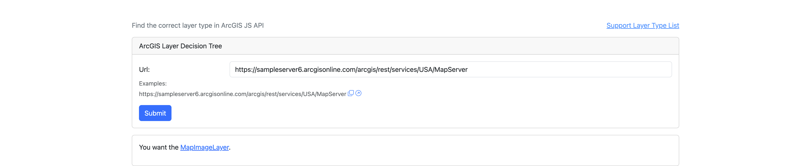

# ArcGIS Layer Decision Tree

English | [简体中文](./README.md)

An interactive tool to help developers quickly determine which Layer type to use in ArcGIS JS API for loading GIS services.

## ✨ Features

- 🧭 Intelligent service type detection
- 🌳 Visual decision tree guidance
- 📖 Official documentation links
- 💻 Support internal network environment

## 🚀How to Use

**Online**

Live demo deployed on GitHub Pages:
[https://geodaoyu.github.io/arcgis-layer-decision-tree/](https://geodaoyu.github.io/arcgis-layer-decision-tree/)

Simply enter your ArcGIS service URL (e.g., `https://services.arcgis.com/.../MapServer`) and follow the interactive guide.

**Offline**

Support internal network environment after deploying by yourself.

**Latest**

ArcGIS CDN version, upgraded with ArcGIS JS API. No Hack. Online only.

## 🔬Technical solution

Hack ArcGIS Layer.[fromArcGISServerUrl](https://developers.arcgis.com/javascript/latest/api-reference/esri-layers-Layer.html#fromArcGISServerUrl) method, return layerName only.

## 🤝Contributing

We welcome contributions! Please:

- Open an issue to discuss your ideas
- Submit pull requests for improvements

---

## 📚 References

- [Learn Ramda](https://davesnx.github.io/learn-ramda/)
- [RxJS Operator Decision Tree](https://rxjs.dev/operator-decision-tree)
